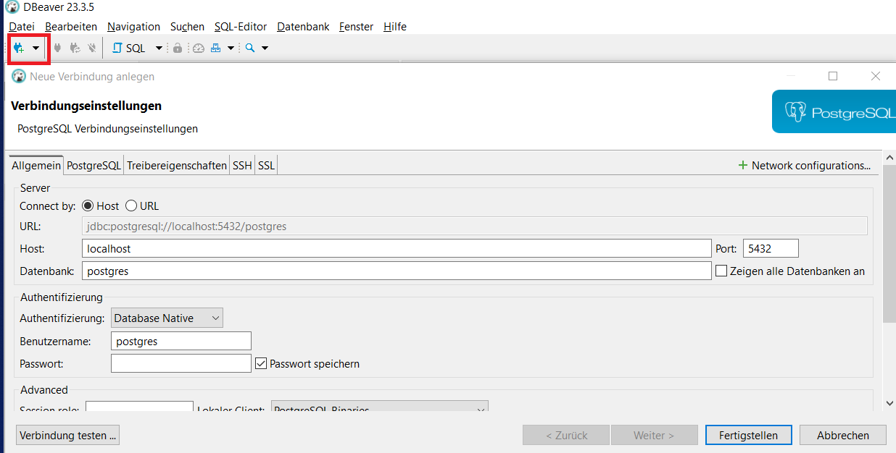
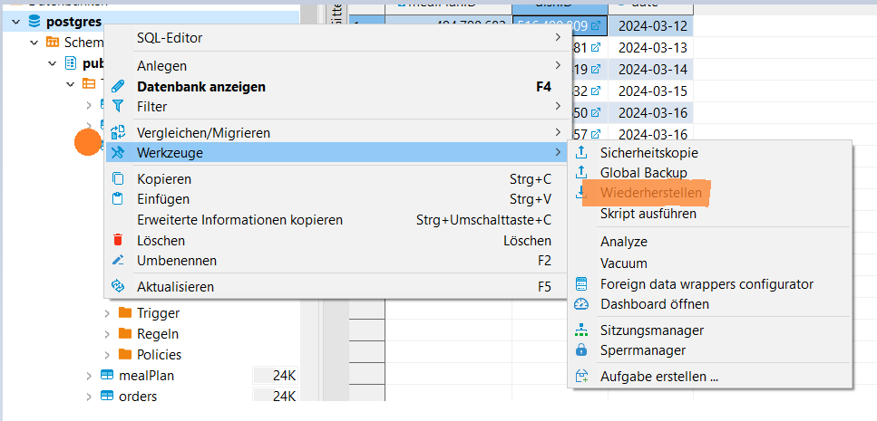

# Kantinerado

## Projektbeschreibung

Dieses Projekt wurde im Rahmen einer Semesterprojektarbeit
der [DHBW Heidenheim](https://www.heidenheim.dhbw.de/startseite) erstellt.  
Dieses Repository enthält den Quellcode für eine Webanwendung, die die Essensbestellungsprozesse für eine Firma
automatisiert. Bisherige manuelle Prozesse, wie das Ausfüllen von Excel-Tabellen, werden durch eine benutzerfreundliche
Webanwendung ersetzt. Die Anwendung ermöglicht die Bestellung von Mahlzeiten für die kommende Woche und bietet
verschiedene Funktionen zur Verbesserung des gesamten Bestellungsprozesses.

## Projektstruktur

Im [Web-App](Web-App) Ordner ist der Code (Frontend/Backend) für die Web-Applikation.

Im [Development](Development) Ordner ist alles weitere was für die Entwicklung benötigt wird (Tools, etc.).

Die [Dokumentation](Dokumentation) kann man hier einsehen.

## Deployment:
Vorraussetzungen:
Python installiert (https://www.python.org/downloads/)
Docker installiert (https://docs.docker.com/get-docker/)
Node.js bzw. NodePackageManager (npm) installiert (https://nodejs.org/en/download)

# Vorgehen:
Der Vorgang des Deployments ist durch einen Befehl vollständig:

1. **Laden sie das Repository herunter**

2. **Gehen Sie in den Ordner ( /Development/Web-App/**

3. **Gehen Sie in die Console und führen Sie folgenden Befehl aus:**
docker-compose up --build

# Datenbank aufsetzen mit Backup
Man muss sich mit dem Datenbank Tool [DBeaver](https://dbeaver.io/) mit der Datenbank verbinden.
1. DBeaver herunterladen
2. Verbindung zur Datenbank herstellen

2.1 Auf das Connector Symbol klicken und PostgreSQL auswählsen  
2.2 Verbindungsdaten eingeben  
2.3 Verbindung testen drücken um zu schauen ob die Verbindung hergestellt werden kann  
2.4 Fertigstellen
   
Das DB Backup liegt [hier](Web-App/Database/Dummy_database.sql) und kann  so geladen werden.
Das Andere DB-Backup [hier](Web-App/Database/Dummy_Database_Presentation.sql) ist zu Präsentationszwecken bereits mit Daten gefüllt. 

# Datenbank aufsetzen ohne Backup

1. **Automatisches Datenbank Setup**
    - Datenbank wird beim starten des Docker-Compose automatisch mit aufgesetz sofern die optionalen Benutzer Informationen in der .env angeben wurden. Genauere Beschreibung [hier](Web-App/ReadMe.md).

## Funktionen

### Grundlegende Funktionen

1. **Web- und Mobile-Anwendung:**
    - Die Anwendung ist sowohl auf Desktop- als auch auf mobilen Endgeräten nutzbar.

2. **Speiseplan in Anwendung:**
    - MitarbeiterInnen der Firma können den wöchentlichen Speiseplan abrufen.
    - KantinenarbeiterInnen können den Speiseplan über Kantinerado einstellen.

### Erweiterte Funktionen

1. **Bestellung direkt in der App:**
    - MitarbeiterInnen der Firma können ihre Bestellungen direkt über die Anwendung aufgeben.

2. **Preiszusammenfassung:**
    - Die Anwendung bietet eine Preisübersicht während des Bestellvorgangs.

3. **Produktinformationen im Speiseplan:**
    - Zusätzliche Informationen zu den Gerichten, wie Preis, Beschreibung und Bild, sind im Speiseplan verfügbar.
    - Als Allergiker kann man einstellen welche Allergien man hat und bekommt bei bestimmten Gerichten den Warnungen

4. **Bestellzeitfenster:**
    - Bestellungen sind bis Donnerstag, 18:00 Uhr, für die kommende Woche möglich.

5. **Änderung der Bestellung:**
    - Änderungen an den Bestellungen sind bis Donnerstag, 18:00 Uhr, möglich.

6. **Zusammenfassung als PDF:**
    - Die MitarbeiterInnen der Firma können eine Zusammenfassung ihrer Wochenbestellung als PDF erhalten oder direkt
      ausdrucken.

7. **Bestellübersicht für Kantinenbetreiber:**
    - Eine Übersicht aller Bestellungen für die Kantinenarbeiter steht zur Verfügung.

8. **Registrierung von Mitarbeitern:**
    - MitarbeiterInnen der Firma können sich mit Namen, E-Mail und Passwort registrieren.

### Zusätzliche Funktionen (nach Bedarf)

1. **Bestellvalidierung:**
    - Validierung der Bestellung gemäß bestimmter Regeln, z.B. keine Bestellung von Menü 1 und Suppe samstags.

2. **Mehrsprachigkeit:**
    - Die Anwendung unterstützt verschiedene Sprachen, einschließlich Deutsch.

3. **Menüvorschläge:**
    - MitarbeiterInnen der Firma können Vorschläge für Menüs einreichen.

4. **Live-Benachrichtigungen:**
    - Benachrichtigungen werden versendet, wenn ein neuer Wochenplan verfügbar ist, sofern dies gewünscht ist.

5. **Kalenderintegration:**
    - Bestellte Mahlzeiten werden automatisch als Termine in einem Kalender angelegt.
