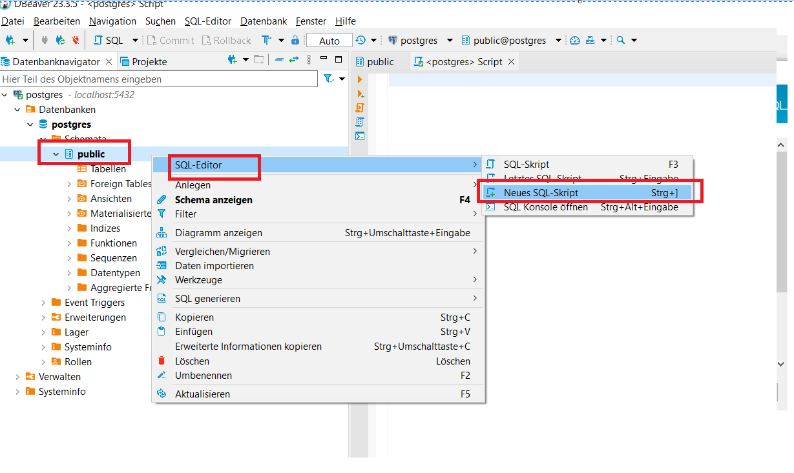

# Datenbank
## Tabellen initialisieren
Wenn die Datenbank erstellt wurde müssen die Tabellen initialisiert werden. Dies wird mit dem Skript [initialize_db.py](initialize_db.py) gemacht. Wichtig ist das man dieses in diesem Ordner ausführt sodass das Passwort der Datenbank richtig gezogen wird.  
Wenn man dieses Skript ausführt wenn die Tabellen schon initialisiert sind führt dies zu keinem Fehler und auch die Daten die in der DB waren bleiben bestehen.

## Tabellen mit DummyDaten befüllen

Im Ordner [Test_Database](./Test_Database/) befinden sich SQL Skripte um die Datenbank zu Testzwecken mit Dummy Daten zu befüllen.

### Ausführen der SQL Skripte
Mit dem Datenbank Tool [DBeaver](https://dbeaver.io/) kann man SQL Skripte einfach in der Datenbank ausführen.
1. DBeaver herunterladen
2. Verbindung zur Datenbank herstellen

2.1 Auf das Connector Symbol klicken und PostgreSQL auswählsen  
2.2 Verbindungsdaten eingeben  
2.3 Verbindung testen drücken um zu schauen ob die Verbindung hergestellt werden kann  
2.4 Fertigstellen
3. Skripte erstellen (Voraussetzung Tabellen wurden schon initialiesiert)

4. In den script Tab die folgenden Skripte einzeln einfügen und mit Strg+Enter ausführen. **Wichtig**: Diese müssen in folgender Reihenfolge ausgeführt werden:    
4.1 **Allergien einfügen:**
   Füge die Allergien in die Tabelle "allergies" ein.  
4.2 **Gerichte einfügen:**
   Füge die Gerichte in die Tabelle "dishes" ein.  
4.3 **Benutzer einfügen:**
   Füge die Benutzer in die Tabelle "users" ein.  
4.4 **Allergien für Benutzer einfügen:**
   Füge die Zuordnung von Benutzern zu ihren Allergien in die Tabelle "user_allergy_association" ein.  
4.5 **Allergien für Gerichte einfügen:**
   Füge die Zuordnung von Gerichten zu ihren Allergien in die Tabelle "dish_allergy_association" ein.  
4.6 **Einträge für das Meal Plan einfügen:**
   Füge die Einträge für den Meal Plan in die Tabelle "mealPlan" ein.  
4.7 **Einträge für Bestellungen einfügen:**
   Füge die Einträge für Bestellungen in die Tabelle "orders" ein.  
